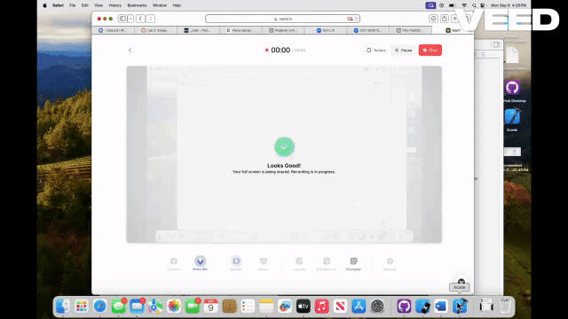

# BeReal Clone (Part 1) - A Social Media App Clone

BeReal Clone (Part 1) - is the first phase of a two-part project designed to replicate key features of the popular social media app BeReal. In this first part, users are able to register, log in, and post images with captions. The app uses a photo library to allow users to upload their current activities, with the aim to replicate the spontaneous photo-sharing experience that BeReal is known for.

- Developer: Noah Russell
- Development Time: Approximately 3 hours
- Technologies Used: Swift, UIKit, Parse SDK (Back4App), Xcode

## Features

The following core features have been successfully implemented in this phase of the project:

- [✅] Styled App Icon and Launch Screen: A custom app icon is displayed on the home screen, and the app has a styled launch screen to give it a professional look and feel.
- [✅] User Authentication: Users can register for a new account and log in with their credentials, providing a personalized experience.
- [✅] Feed of Posts: After logging in, users are shown a feed of posts made by others (this is the initial stage of the social media feed).
- [✅] Post Uploading: Users can upload a photo from their device’s photo library and optionally add a caption to their post.
- [✅] Logout Functionality: Users can log out of their account to start fresh or switch accounts.

## Optional Features

At this stage, no optional features have been implemented but are planned for future releases.

- [❌] Additional features like notifications or post visibility settings will be added in Part 2.

## Future Enhancements

- [🔲] Notifications: Adding functionality for push notifications when it’s time to post.
- [🔲] Friendship System: Implementing a friends list and limiting feed visibility to friends’ posts only.
- [🔲] Post Visibility: Making posts visible only after the user has posted their own photo.

## Video Walkthrough

Below is a demonstration of the current functionality in the app:

GIF created with VEED.io.

## Development Process

This project I created as part of a two-part series to develop a social media app similar to BeReal. Here are the key concepts covered in this phase:

- UIKit: Used to create a clean, simple, and intuitive interface for users.
- Parse SDK (Back4App): Backend integration to handle user authentication and post data storage.
- Firebase/Cloud Storage: For storing images and ensuring they are uploaded and retrieved efficiently.
- App Lifecycle: Understanding how to manage login sessions, feed refresh, and user state.

## Challenges Faced

- Database Integration: There were some initial issues with the Back4App database configuration, but these were resolved by revisiting the backend setup and checking API keys.
- User Authentication Flow: Ensuring smooth transitions between the login, registration, and feed screens posed some challenges with managing view controllers and segueing between them correctly.

## Key Takeaways

- Deepened knowledge of backend integration with Parse and handling user data.
- Gained experience in managing user authentication flows in a real-world app scenario.
- Familiarized myself with using photo libraries to handle user-generated content in iOS apps.

## Technologies Used

- Programming Language: Swift
- Frameworks: UIKit, Parse SDK (Back4App)
- Database: Back4App (Parse Server)
- Development Environment: Xcode 14.0+
- Version Control: Git, GitHub

## License

BeReal Clone is licensed under the Apache License 2.0.
You may obtain a copy of the license at:
http://www.apache.org/licenses/LICENSE-2.0

